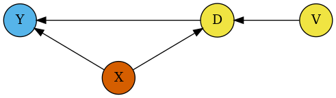
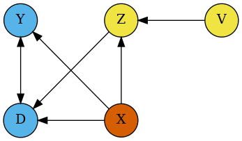

O pacote [`DoubleML`](https://docs.doubleml.org/stable/index.html#doubleml-package) incluem os seguintes modelos.

## 3.1 - Modelos Linearmente Parciais (PLM)

Os modelos parcialmente lineares (PLM) assumem a forma

$$
Y = D\theta_0+g_0(Z) +\zeta,
$$ onde os efeitos do tratamento são aditivos com algum tipo de forma linear.

### 3.1.1 - Modelo de Regressão Linear Parcial (PLR)

**Regressão parcialmente linear (PLR)** assume a forma

$$
Y = D\theta_0 + g_0(X) + \zeta, \quad \mathbb{E}(\zeta \mid D, X) = 0,
$$

$$
D = m_0(X) + V, \quad \mathbb{E}(V \mid X) = 0,
$$

onde $Y$ é a variável de resultado e $D$ é a variável de política de interesse.\
O vetor de alta dimensão $X = (X_1, \ldots, X_p)$ consiste em outras covariáveis de confusão,\
e $\zeta$ e $V$ são erros estocásticos.

{fig-align="center"}

`DoubleMLPLR` implementa modelos PLR. A estimação é realizada por meio do método `fit()`.

> **Nota**\
> Observe que a abordagem padrão com `score='partialling out'`\
> não se baseia em uma estimativa direta de $g_0(X)$, mas sim em\
> $$
> \ell_0(X) := \mathbb{E}[Y \mid X] = \theta_0 \mathbb{E}[D \mid X] + g(X).
> $$

```{r message = FALSE, warning = FALSE}

library(DoubleML)

library(mlr3)

library(mlr3learners)

library(data.table)

lgr::get_logger("mlr3")$set_threshold("warn")


learner = lrn(
  "regr.ranger",
  num.trees = 100,
  mtry = 20,
  min.node.size = 2,
  max.depth = 5
)

ml_l = learner$clone()

ml_m = learner$clone()

set.seed(1111)

data = make_plr_CCDDHNR2018(alpha=0.5, n_obs=500, dim_x=20, return_type='data.table')

obj_dml_data = DoubleMLData$new(data, y_col="y", d_cols="d")

dml_plr_obj = DoubleMLPLR$new(obj_dml_data, ml_l, ml_m)

dml_plr_obj$fit()

print(dml_plr_obj)

```

### 3.1.2 - Modelo de Regressão IV Linear Parcial (PLIV)

**Regressão IV parcialmente linear (PLIV)** assume a forma

$$
Y - D\theta_0 = g_0(X) + \zeta, \quad \mathbb{E}(\zeta \mid Z, X) = 0,
$$

$$
Z = m_0(X) + V, \quad \mathbb{E}(V \mid X) = 0.
$$

onde $Y$ é a variável de resultado, $D$ é a variável de política de interesse, e $Z$ representa uma ou várias variáveis instrumentais.\
O vetor de alta dimensão $X = (X_1, \ldots, X_p)$ consiste em outras covariáveis de confusão,\
e $\zeta$ e $V$ são erros estocásticos.

{fig-align="center"}

`DoubleMLPLIV` implementa modelos PLIV. A estimação é realizada por meio do método `fit()`.

```{r message = FALSE, warning = FALSE}

library(DoubleML)

library(mlr3)

library(mlr3learners)

library(data.table)

learner = lrn(
  "regr.ranger",
  num.trees = 100,
  mtry = 20,
  min.node.size = 2,
  max.depth = 5
)

ml_l = learner$clone()

ml_m = learner$clone()

ml_r = learner$clone()

set.seed(2222)

data = make_pliv_CHS2015(
  alpha = 0.5,
  n_obs = 500,
  dim_x = 20,
  dim_z = 1,
  return_type = "data.table"
)

obj_dml_data = DoubleMLData$new(data,
                                y_col = "y",
                                d_col = "d",
                                z_cols = "Z1")

dml_pliv_obj = DoubleMLPLIV$new(obj_dml_data, ml_l, ml_m, ml_r)

dml_pliv_obj$fit()

print(dml_pliv_obj)

```

## 3.2 - Modelos de Regressão Interativa (IRM)

O modelo de regressão interativa (IRM) assume a forma

$$
Y = g_0(D, X) + U,
$$

onde os efeitos do tratamento são totalmente heterogêneos.

### 3.2.1 - Modelo de Regressão Interativa Binária (IRM)

**Regressão interativa (IRM)** assume a forma

$$
Y = g_0(D, X) + U, \quad \mathbb{E}(U \mid X, D) = 0,
$$

$$
D = m_0(X) + V, \quad \mathbb{E}(V \mid X) = 0,
$$

onde a variável de tratamento é binária, $D \in \{0, 1\}$. Considera-se a estimação dos efeitos médios do tratamento quando os efeitos do tratamento são totalmente heterogêneos.

Os parâmetros de interesse nesse modelo são o **efeito médio do tratamento (ATE)**,

$$
\theta_0 = \mathbb{E}[g_0(1, X) - g_0(0, X)]
$$

e o **efeito médio do tratamento sobre os tratados (ATTE)**,

$$
\theta_0 = \mathbb{E}[g_0(1, X) - g_0(0, X) \mid D = 1].
$$ 

{fig-align="center"}

`DoubleMLIRM` implementa modelos IRM. A estimação é realizada por meio do método `fit()`.

```{r message = FALSE, warning = FALSE}

library(DoubleML)

library(mlr3)

library(mlr3learners)

library(data.table)

set.seed(3333)

ml_g = lrn(
  "regr.ranger",
  num.trees = 100,
  mtry = 10,
  min.node.size = 2,
  max.depth = 5
)

ml_m = lrn(
  "classif.ranger",
  num.trees = 100,
  mtry = 10,
  min.node.size = 2,
  max.depth = 5
)

data = make_irm_data(
  theta = 0.5,
  n_obs = 500,
  dim_x = 10,
  return_type = "data.table"
)

obj_dml_data = DoubleMLData$new(data, y_col = "y", d_cols = "d")

dml_irm_obj = DoubleMLIRM$new(obj_dml_data, ml_g, ml_m)

dml_irm_obj$fit()

print(dml_irm_obj)

```

### 3.2.2 - Resultados Potenciais Médios (APOs)

Para tratamentos com valores discretos gerais $D \in \{d_0, \ldots, d_l\}$, o modelo pode ser generalizado para

$$
Y = g_0(D, X) + U, \quad \mathbb{E}(U \mid X, D) = 0,
$$

$$
A_j = m_{0,j}(X) + V, \quad \mathbb{E}(V \mid X) = 0,
$$

onde $A_j := \mathbb{1}\{D = d_j\}$ é uma variável indicadora para o nível de tratamento $d_j$\
e $m_{0,j}(X)$ denota o escore de propensão correspondente.

Os possíveis parâmetros de interesse neste modelo são os **resultados potenciais médios** (APOs — *average potential outcomes*)

$$
\theta_{0,j} = \mathbb{E}[g_0(d_j, X)].
$$

`DoubleMLAPO` implementa a estimação dos resultados potenciais médios.\
A estimação é realizada por meio do método `fit()`.

``` python

import numpy as np

import doubleml as dml

from doubleml.datasets import make_irm_data

from sklearn.ensemble import RandomForestRegressor, RandomForestClassifier

ml_g = RandomForestRegressor(n_estimators=100, max_features=10, max_depth=5, min_samples_leaf=2)

ml_m = RandomForestClassifier(n_estimators=100, max_features=10, max_depth=5, min_samples_leaf=2)

np.random.seed(3333)

data = make_irm_data(theta=0.5, n_obs=500, dim_x=10, return_type='DataFrame')

obj_dml_data = dml.DoubleMLData(data, 'y', 'd')

dml_apo_obj = dml.DoubleMLAPO(obj_dml_data, ml_g, ml_m, treatment_level=0)

print(dml_apo_obj.fit())

================== DoubleMLAPO Object ==================

------------------ Data summary      ------------------
Outcome variable: y
Treatment variable(s): ['d']
Covariates: ['X1', 'X2', 'X3', 'X4', 'X5', 'X6', 'X7', 'X8', 'X9', 'X10']
Instrument variable(s): None
No. Observations: 500

------------------ Score & algorithm ------------------
Score function: APO

------------------ Machine learner   ------------------
Learner ml_g: RandomForestRegressor(max_depth=5, max_features=10, min_samples_leaf=2)
Learner ml_m: RandomForestClassifier(max_depth=5, max_features=10, min_samples_leaf=2)
Out-of-sample Performance:
Regression:
Learner ml_g_d_lvl0 RMSE: [[1.09351167]]
Learner ml_g_d_lvl1 RMSE: [[1.07085301]]
Classification:
Learner ml_m Log Loss: [[0.55863386]]

------------------ Resampling        ------------------
No. folds: 5
No. repeated sample splits: 1

------------------ Fit summary       ------------------
      coef   std err         t     P>|t|     2.5 %    97.5 %
d -0.13084  0.137165 -0.953884  0.340142 -0.399679  0.137999
```

### 3.2.3 - Resultados Potenciais Médios (APOs) para Múltiplos Níveis de Tratamento

Se múltiplos níveis de tratamento devem ser estimados simultaneamente,\
outro possível parâmetro de interesse neste modelo são os **contrastes**\
(ou efeitos médios do tratamento) entre os níveis de tratamento $d_j$ e $d_k$:

$$
\theta_{0,jk} = \mathbb{E}[g_0(d_j, X) - g_0(d_k, X)].
$$

`DoubleMLAPOS` implementa a estimação dos resultados potenciais médios para múltiplos níveis de tratamento.\
A estimação é realizada por meio do método `fit()`.\
O método `causal_contrast()` permite estimar contrastes causais entre os níveis de tratamento.

``` pytohn

import numpy as np

import doubleml as dml

from doubleml.datasets import make_irm_data

from sklearn.ensemble import RandomForestRegressor, RandomForestClassifier

ml_g = RandomForestRegressor(n_estimators=100, max_features=10, max_depth=5, min_samples_leaf=2)

ml_m = RandomForestClassifier(n_estimators=100, max_features=10, max_depth=5, min_samples_leaf=2)

np.random.seed(3333)

data = make_irm_data(theta=0.5, n_obs=500, dim_x=10, return_type='DataFrame')

obj_dml_data = dml.DoubleMLData(data, 'y', 'd')

dml_apos_obj = dml.DoubleMLAPOS(obj_dml_data, ml_g, ml_m, treatment_levels=[0, 1])

print(dml_apos_obj.fit())


causal_contrast_model = dml_apos_obj.causal_contrast(reference_levels=0)

print(causal_contrast_model.summary)


================== DoubleMLAPOS Object ==================

------------------ Fit summary       ------------------
       coef   std err         t     P>|t|     2.5 %    97.5 %
0 -0.152706  0.186689 -0.817967  0.413376 -0.518610  0.213199
1  0.533283  0.134784  3.956588  0.000076  0.269112  0.797454

causal_contrast_model = dml_apos_obj.causal_contrast(reference_levels=0)

print(causal_contrast_model.summary)
            coef   std err         t     P>|t|     2.5 %   97.5 %
1 vs 0  0.685989  0.231734  2.960236  0.003074  0.231798  1.14018
```

### 3.2.4 - Modelo IV Interativo (IIVM)

**Regressão IV interativa (IIVM)** assume a forma

$$
Y = \ell_0(D, X) + \zeta, \quad \mathbb{E}(\zeta \mid Z, X) = 0,
$$

$$
Z = m_0(X) + V, \quad \mathbb{E}(V \mid X) = 0,
$$

onde a variável de tratamento é binária, $D \in \{0, 1\}$, e o instrumento é binário, $Z \in \{0, 1\}$.\
Considere as funções $g_0$, $r_0$ e $m_0$, onde $g_0$ mapeia o suporte de $(Z, X)$ em $\mathbb{R}$, e $r_0$ e $m_0$ mapeiam, respectivamente, o suporte de $(Z, X)$ e de $X$ para $(\varepsilon, 1 - \varepsilon)$ para algum $\varepsilon \in (0, 1/2)$, de modo que:

$$
Y = g_0(Z, X) + \nu, \quad \mathbb{E}(\nu \mid Z, X) = 0,
$$

$$
D = r_0(Z, X) + U, \quad \mathbb{E}(U \mid Z, X) = 0,
$$

$$
Z = m_0(X) + V, \quad \mathbb{E}(V \mid X) = 0.
$$

O parâmetro de interesse neste modelo é o **efeito médio local do tratamento (LATE)**:

$$
\theta_0 = \frac{\mathbb{E}[g_0(1, X)] - \mathbb{E}[g_0(0, X)]}{\mathbb{E}[r_0(1, X)] - \mathbb{E}[r_0(0, X)]}.
$$

{fig-align="center"}

`DoubleMLIIVM` implementa modelos IIVM. A estimação é realizada por meio do método `fit()`.

```{r message = FALSE, warning = FALSE}

library(DoubleML)

library(mlr3)

library(mlr3learners)

library(data.table)

set.seed(4444)

ml_g = lrn(
  "regr.ranger",
  num.trees = 100,
  mtry = 20,
  min.node.size = 2,
  max.depth = 5
)

ml_m = lrn(
  "classif.ranger",
  num.trees = 100,
  mtry = 20,
  min.node.size = 2,
  max.depth = 5
)

ml_r = ml_m$clone()

data = make_iivm_data(
  theta = 0.5,
  n_obs = 1000,
  dim_x = 20,
  alpha_x = 1,
  return_type = "data.table"
)

obj_dml_data = DoubleMLData$new(data,
                                y_col = "y",
                                d_cols = "d",
                                z_cols = "z")

dml_iivm_obj = DoubleMLIIVM$new(obj_dml_data, ml_g, ml_m, ml_r)

dml_iivm_obj$fit()

print(dml_iivm_obj)

```

## 3.3 - Modelos de Diferença em Diferenças (DID)

**Modelos de Diferença-em-Diferenças (DID)** implementados no pacote concentram-se no caso de tratamento binário com adoção escalonada.

> ℹ️ **Nota**\
> A notação e as suposições de identificação são baseadas em [Callaway e Sant’Anna (2021)](https://doi.org/10.1016/j.jeconom.2020.12.001),\
> mas ajustadas para melhor se adequar às convenções da documentação geral do pacote, às vezes abusando levemente da notação.\
> As funções de escore subjacentes são baseadas em [Sant’Anna e Zhao (2020)], [Zimmert (2018)] e [Chang (2020)].\
> Para uma introdução mais detalhada e desenvolvimentos recentes da literatura de diferenças-em-diferenças, veja por exemplo [Roth et al. (2022)].


Consideramos $n$ unidades observadas nos períodos de tempo $t = 1, \ldots, \mathcal{T}$.\
O status de tratamento da unidade $i$ no tempo $t$ é denotado pela variável binária $D_{i,t} = 1$.\
O pacote considera o cenário de adoção escalonada, onde uma unidade permanece tratada após ter sido tratada uma vez\
(**Irreversibilidade do Tratamento**).

Seja $G_i^g$ uma variável indicadora que assume valor um se a unidade $i$ for tratada no período $t = g$:

$$
G_i^g = \mathbb{1}\{G_i = g\}
$$

com $G_i$ se referindo ao primeiro período pós-tratamento. Se a unidade nunca foi tratada, definimos $G_i = \infty$.


Os parâmetros de interesse são definidos em termos de **diferenças entre desfechos potenciais**.\
O resultado observado e potencial para cada unidade $i$ no tempo $t$ é assumido da forma:

$$
Y_{i,t} = Y_{i,t}(0) + \sum_{g=2}^{\mathcal{T}} \left(Y_{i,t}(g) - Y_{i,t}(0)\right) \cdot G_i^g,
$$

de modo que observamos um único desfecho potencial por unidade em cada período.

Os parâmetros correspondentes de interesse são os **efeitos causais médios do tratamento**:

$$
ATT(g, t) := \mathbb{E}\left[Y_{i,t}(g) - Y_{i,t}(0) \mid G_i^g = 1\right].
$$

Esse parâmetro quantifica a variação média nos desfechos potenciais para unidades tratadas pela primeira vez no período $g$,\
sendo a diferença de resultado avaliada no período $t$. Os grupos de controle correspondentes, definidos por um indicador $C$,\
podem ser definidos como unidades **nunca tratadas** ou **ainda não tratadas**.

Definições:

-   $C_{i,t}^{(nev)} := \mathbb{1}\{G_i = \infty\}$ (nunca tratadas)\
-   $C_{i,t}^{(nyt)} := \mathbb{1}\{G_i > t\}$ (ainda não tratadas)


### Suposições de Identificação:

1.  **Irreversibilidade do Tratamento:**\
    $D_{i,1} = 0$ a.s. Para todo $t = 2, \ldots, \mathcal{T}$, $D_{i,t-1} = 1$ implica $D_{i,t} = 1$ a.s.

2.  **Dados em Painel (Amostragem Aleatória):**\
    $$
    (Y_{i,1}, \ldots, Y_{i,\mathcal{T}}, X_i, D_{i,1}, \ldots, D_{i,\mathcal{T}})_{i=1}^n \text{ é i.i.d.}
    $$

3.  **Antecipação Limitada do Tratamento:**\
    Existe $\delta \geq 0$ tal que

    $$
    \mathbb{E}[Y_{i,t}(g) \mid X_i, G_i^g = 1] = \mathbb{E}[Y_{i,t}(0) \mid X_i, G_i^g = 1] \quad \text{a.s.}
    $$

    para todo $g \in \mathcal{G}, \, t \in \{1, \ldots, \mathcal{T}\}$ tal que $t < g - \delta$.

4.  **Tendências Paralelas Condicionais:**\
    Seja $\delta$ como definido na Assunção 3. Para cada $g \in \mathcal{G}$ e $t \in \{2, \ldots, \mathcal{T}\}$ tal que $t \geq g - \delta$:

    -   **a. Nunca Tratadas:**

        $$
        \mathbb{E}[Y_{i,t}(0) - Y_{i,t-1}(0) \mid X_i, G_i^g = 1] = \mathbb{E}[Y_{i,t}(0) - Y_{i,t-1}(0) \mid X_i, C_i^{(nev)} = 1]
        $$

    -   **b. Ainda Não Tratadas:**

        $$
        \mathbb{E}[Y_{i,t}(0) - Y_{i,t-1}(0) \mid X_i, G_i^g = 1] = \mathbb{E}[Y_{i,t}(0) - Y_{i,t-1}(0) \mid X_i, C_{i,t+\delta}^{(nyt)} = 1]
        $$

5.  **Sobreposição (Overlap):**\
    Para cada período $t = 2, \ldots, \mathcal{T}$ e $g \in \mathcal{G}$ existe $\varepsilon > 0$ tal que:

    $$
    P(G_i^g = 1) > \varepsilon \quad \text{e} \quad P(G_i^g = 1 \mid X_i, G_i^g + C_{i,t}^{(nyt)} = 1) < 1 - \varepsilon \quad \text{a.s.}
    $$

> ℹ️ **Nota**\
> Para uma discussão detalhada das suposições, veja [Callaway e Sant’Anna (2021)](https://doi.org/10.1016/j.jeconom.2020.12.001).


Sob as suposições acima (Assunção 4.a ou 4.b), o parâmetro de interesse $ATT(g, t)$ é identificável.\
Veja o Teorema 1 em [Callaway e Sant’Anna (2021)](https://doi.org/10.1016/j.jeconom.2020.12.001).

### 3.3.1 - Dados em Painel

Para estimar os parâmetros de interesse $ATT(g, t)$, as seguintes funções auxiliares são requeridas:

$$
g_{0,g,t_{\text{pre}},t_{\text{eval}},\delta}(X_i) := \mathbb{E}[Y_{i,t_{\text{eval}}} - Y_{i,t_{\text{pre}}} \mid X_i, C^{(\cdot)}_{i,t_{\text{eval}}+\delta} = 1],
$$

$$
m_{0,g,t_{\text{eval}}+\delta}(X_i) := \mathbb{P}(G_i^g = 1 \mid X_i, G_i^g + C^{(\cdot)}_{i,t_{\text{eval}}+\delta} = 1),
$$

onde $g_{0,g,t_{\text{pre}},t_{\text{eval}},\delta}(\cdot)$ denota a função de regressão do desfecho populacional  
e $m_{0,g,t_{\text{eval}}+\delta}(\cdot)$ o escore de propensão generalizado.

**Interpretação dos parâmetros:**

- $g$ é o primeiro período pós-tratamento de interesse, ou seja, o grupo tratado.
- $t_{\text{pre}}$ é o período pré-tratamento, do qual se assume a validade das tendências paralelas condicionais.
- $t_{\text{eval}}$ é o período de avaliação onde o efeito do tratamento é estimado.
- $\delta$ é o número de períodos de antecipação, ou seja, o número de períodos nos quais as unidades podem antecipar o tratamento.

> ℹ️ **Nota**  
> As funções auxiliares dependem do grupo de controle usado na estimação.  
> Por um leve abuso de notação, usa-se a mesma notação para ambos os grupos de controle  
> $C_{i,t}^{(\text{nev})}$ e $C_{i,t}^{(\text{nyt})}$.  
> Mais especificamente, o grupo de controle depende de $\delta$ **apenas** para as unidades **ainda não tratadas**.

---

Sob essas suposições, o parâmetro de interesse $ATT(g, t_{\text{eval}})$ pode ser estimado escolhendo  
uma combinação adequada de $(g, t_{\text{pre}}, t_{\text{eval}}, \delta)$  
se $t_{\text{eval}} - t_{\text{pre}} \geq 1 + \delta$, ou seja, as tendências paralelas  
devem valer por **pelo menos um período a mais do que o período de antecipação**.

> ℹ️ **Nota**  
> A escolha $t_{\text{pre}} = \min(g, t_{\text{eval}}) - \delta - 1$ corresponde à definição de  
> $ATT_{dr}(g, t_{\text{eval}}; \delta)$ de [Callaway e Sant’Anna (2021)](https://doi.org/10.1016/j.jeconom.2020.12.001).  
>
> **Exemplo:** Se o parâmetro de interesse é o efeito sobre o grupo tratado em 2006, avaliado em 2007,  
> com $\delta = 1$, então o período pré-tratamento é 2004.  
> A suposição de tendência paralela será mais forte com antecipação, exigindo tendências paralelas por mais períodos:
>
> $$
> ATT_{dr}(2006, 2007; 1) = ATT(2006, 2004; 2006).
> $$

---

A seguir, omite-se o subescrito $\delta$ na notação das funções auxiliares e do grupo de controle,  
assumindo implicitamente $\delta = 0$.

Para um dado triplo $(g, t_{\text{pre}}, t_{\text{eval}})$, o parâmetro $ATT(g, t_{\text{eval}})$  
é estimado resolvendo a seguinte condição de momento linear empírica:

$$
ATT(g, t_{\text{pre}}, t_{\text{eval}}) := -\frac{\mathbb{E}[\psi_b(W, \eta_0)]}{\mathbb{E}[\psi_a(W, \eta_0)]},
$$

com elementos auxiliares $\eta_0 = (g_{0,g,t_{\text{pre}},t_{\text{eval}}}, \, m_{0,g,t_{\text{eval}}})$  
e função escore $\psi(W, \theta, \eta)$ definida na seção [*Panel Data*](https://docs.doubleml.org/stable/guide/scores.html#did-pa-score).

Sob as suposições de identificação:

$$
ATT(g, t_{\text{pre}}, t_{\text{eval}}) = ATT(g, t).
$$

---

`DoubleMLDIDMulti` implementa a estimação de $ATT(g, t_{\text{pre}}, t_{\text{eval}})$ para múltiplos períodos  
e requer [`DoubleMLPanelData`](https://docs.doubleml.org/stable/guide/data_backend.html#dml-panel-data) como entrada. Definindo `gt_combinations='standard'` estima-se o parâmetro-alvo para todas  
as combinações possíveis de $(g, t_{\text{pre}}, t_{\text{eval}})$ com:

- $g \in \{2, \ldots, \mathcal{T}\}$
- $t_{\text{pre}}, t_{\text{eval}} \in \{2, \ldots, \mathcal{T}\}$
- $t_{\text{pre}} = \min(g, t_{\text{eval}}) - \delta - 1$

Isso corresponde ao cenário em que as tendências são fixadas no menor intervalo possível,  
ainda respeitando o período de antecipação.

A estimação é realizada por meio do método `fit()`.

``` python

import numpy as np

import doubleml as dml

from doubleml.did.datasets import make_did_CS2021

from sklearn.ensemble import RandomForestRegressor, RandomForestClassifier

np.random.seed(42)

df = make_did_CS2021(n_obs=500)

dml_data = dml.data.DoubleMLPanelData(
    df,
    y_col="y",
    d_cols="d",
    id_col="id",
    t_col="t",
    x_cols=["Z1", "Z2", "Z3", "Z4"],
    datetime_unit="M"
)


dml_did_obj = dml.did.DoubleMLDIDMulti(
    obj_dml_data=dml_data,
    ml_g=RandomForestRegressor(min_samples_split=10),
    ml_m=RandomForestClassifier(min_samples_split=10),
    gt_combinations="standard",
    control_group="never_treated",
)


print(dml_did_obj.fit())
================== DoubleMLDIDMulti Object ==================

------------------ Data summary      ------------------
Outcome variable: y
Treatment variable(s): ['d']
Covariates: ['Z1', 'Z2', 'Z3', 'Z4']
Instrument variable(s): None
Time variable: t
Id variable: id
No. Observations: 500

------------------ Score & algorithm ------------------
Score function: observational
Control group: never_treated
Anticipation periods: 0

------------------ Machine learner   ------------------
Learner ml_g: RandomForestRegressor(min_samples_split=10)
Learner ml_m: RandomForestClassifier(min_samples_split=10)
Out-of-sample Performance:
Regression:
Learner ml_g0 RMSE: [[ 4.18516129  3.93074943  7.02260304 11.27461519  4.07788588  4.29168951
   3.95311164  8.07229774  3.79330022  3.90145324  4.00518448  3.89472978]]
Learner ml_g1 RMSE: [[3.11942111 3.42094064 6.87309461 9.51494845 4.31910229 3.59563003
  3.86897905 7.36696349 3.97619643 3.94427158 3.77746575 4.38470495]]
Classification:
Learner ml_m Log Loss: [[0.70344386 0.72269685 0.70305686 0.70557077 0.7204309  0.69572427
  0.70774361 0.72987186 0.76535102 0.78386025 0.74475816 0.79953099]]

------------------ Resampling        ------------------
No. folds: 5
No. repeated sample splits: 1

------------------ Fit summary       ------------------
                                  coef   std err  ...     2.5 %    97.5 %
ATT(2025-03,2025-01,2025-02) -0.698642  0.489488  ... -1.658021  0.260738
ATT(2025-03,2025-02,2025-03)  0.211002  0.496591  ... -0.762299  1.184303
ATT(2025-03,2025-02,2025-04)  0.900127  0.938263  ... -0.938836  2.739089
ATT(2025-03,2025-02,2025-05)  2.001603  1.568932  ... -1.073447  5.076653
ATT(2025-04,2025-01,2025-02)  0.046507  0.430465  ... -0.797189  0.890204
ATT(2025-04,2025-02,2025-03)  0.108870  0.479959  ... -0.831833  1.049573
ATT(2025-04,2025-03,2025-04)  0.952146  0.463816  ...  0.043082  1.861210
ATT(2025-04,2025-03,2025-05)  2.918293  0.891527  ...  1.170933  4.665653
ATT(2025-05,2025-01,2025-02) -0.082905  0.468449  ... -1.001049  0.835239
ATT(2025-05,2025-02,2025-03) -0.035689  0.643679  ... -1.297276  1.225899
ATT(2025-05,2025-03,2025-04)  0.270248  0.443672  ... -0.599334  1.139830
ATT(2025-05,2025-04,2025-05)  1.186775  0.542268  ...  0.123950  2.249601

[12 rows x 6 columns]

```

> ℹ️ **Nota**  
> O resultado contém duas diferentes regressões de desfecho $g(0, X)$ e $g(1, X)$.  
> Assim como no [modelo IRM](https://docs.doubleml.org/stable/guide/models.html#irm-model),  
> a regressão de desfecho $g(0, X)$ refere-se ao **grupo de controle**, enquanto $g(1, X)$ refere-se  
> à regressão de desfecho para o **grupo tratado**, isto é:

$$
g(0, X) \approx g_{0,g,t_{\text{pre}},t_{\text{eval}},\delta}(X_i) = \mathbb{E}[Y_{i,t_{\text{eval}}} - Y_{i,t_{\text{pre}}} \mid X_i, C^{(\cdot)}_{i,t_{\text{eval}}+\delta} = 1],
$$

$$
g(1, X) \approx \mathbb{E}[Y_{i,t_{\text{eval}}} - Y_{i,t_{\text{pre}}} \mid X_i, G_i^g = 1].
$$

Além disso, $g(1, X)$ é utilizado apenas para [Análise de Sensibilidade](https://docs.doubleml.org/stable/guide/sensitivity.html#sensitivity-did-pa)  
e **não é utilizado para a estimação do parâmetro de interesse**.

> ℹ️ **Nota**  
> Um exemplo mais detalhado está disponível na [Galeria de Exemplos](https://docs.doubleml.org/stable/examples/index.html#did-examplegallery).


### 3.3.2 - Seções Transversais Repetidas

> ℹ️ **Nota**  
> Será implementado em breve.

### 3.3.3 - Agregação de Efeitos

A seção a seguir considera a **agregação de diferentes $ATT(g, t)$** em medidas resumo, com base em  
[Callaway e Sant’Anna (2021)](https://doi.org/10.1016/j.jeconom.2020.12.001).  
Todos os esquemas de agregação implementados assumem a forma de uma **média ponderada** das estimativas $ATT(g, t)$:

$$
\theta = \sum_{g \in \mathcal{G}} \sum_{t = 2}^{\mathcal{T}} \omega(g, t) \cdot ATT(g, t)
$$

onde $\omega(g, t)$ é uma função de peso baseada no grupo de tratamento $g$ e no período de tempo $t$.

Os esquemas de agregação são implementados por meio do método `aggregate()` da classe `DoubleMLDIDMulti`.


``` pytohn 

import numpy as np

import doubleml as dml

from doubleml.did.datasets import make_did_CS2021

from sklearn.ensemble import RandomForestRegressor, RandomForestClassifier

np.random.seed(42)

df = make_did_CS2021(n_obs=500)

dml_data = dml.data.DoubleMLPanelData(
    df,
    y_col="y",
    d_cols="d",
    id_col="id",
    t_col="t",
    x_cols=["Z1", "Z2", "Z3", "Z4"],
    datetime_unit="M"
)


dml_did_obj = dml.did.DoubleMLDIDMulti(
    obj_dml_data=dml_data,
    ml_g=RandomForestRegressor(min_samples_split=10),
    ml_m=RandomForestClassifier(min_samples_split=10),
    gt_combinations="standard",
    control_group="never_treated",
)


dml_did_obj.fit()
Out[9]: <doubleml.did.did_multi.DoubleMLDIDMulti at 0x7fccdbb05550>

agg_did_obj = dml_did_obj.aggregate(aggregation="group")

agg_did_obj.aggregated_frameworks.bootstrap()
Out[11]: <doubleml.double_ml_framework.DoubleMLFramework at 0x7fccdba0a210>

print(agg_did_obj)
================== DoubleMLDIDAggregation Object ==================
 Group Aggregation 

------------------ Overall Aggregated Effects ------------------
    coef  std err        t    P>|t|   2.5 %   97.5 %
1.389489 0.537438 2.585394 0.009727 0.33613 2.442847
------------------ Aggregated Effects         ------------------
             coef   std err         t     P>|t|     2.5 %    97.5 %
2025-03  1.037577  0.943693  1.099485  0.271556 -0.812028  2.887182
2025-04  1.935220  0.642648  3.011323  0.002601  0.675653  3.194786
2025-05  1.186775  0.542268  2.188541  0.028630  0.123950  2.249601
------------------ Additional Information     ------------------
Score function: observational
Control group: never_treated
Anticipation periods: 0

```
O método `aggregate()` requer que o argumento `aggregation` seja definido como um dos seguintes valores:

- `'group'`: agrega as estimativas $ATT(g, t)$ pelo grupo de tratamento $g$.
- `'time'`: agrega as estimativas $ATT(g, t)$ pelo período de tempo $t$ (com base no tamanho do grupo).
- `'eventstudy'`: agrega as estimativas $ATT(g, t)$ com base na diferença de tempo até o primeiro tratamento, como em um estudo de eventos (com base no tamanho do grupo).
- `'dictionary'`: um dicionário com valores que contêm os pesos de agregação (como `numpy.ma.MaskedArray`).

> ℹ️ **Nota**  
> Um exemplo mais detalhado sobre agregação de efeitos está disponível na [galeria de exemplos](https://docs.doubleml.org/stable/examples/index.html#did-examplegallery).  
> Para uma discussão completa sobre os diferentes esquemas de agregação, consulte [Callaway e Sant’Anna (2021)](https://doi.org/10.1016/j.jeconom.2020.12.001).

### 3.3.4 - Dois Períodos de Tratamento

> ⚠️ **Aviso**  
> Esta documentação refere-se à implementação descontinuada para dois períodos de tempo.  
> Essa funcionalidade será removida em uma versão futura.

> ℹ️ **Nota**  
> Recomendamos o uso da implementação com [dados em painel](https://docs.doubleml.org/stable/guide/models.html#did-pa-model)  
> e [seções transversais repetidas](https://docs.doubleml.org/stable/guide/models.html#did-cs-model).

---

**Modelos de Diferença-em-Diferenças (DID)** implementados no pacote concentram-se no caso de tratamento binário com dois períodos.

Adotando a notação de [Sant’Anna e Zhao (2020)](https://doi.org/10.1016/j.jeconom.2020.06.003),  
seja $Y_{it}$ o desfecho de interesse para a unidade $i$ no tempo $t$.  
Considere $D_{it} = 1$ se a unidade $i$ foi tratada antes do tempo $t$ (caso contrário, $D_{it} = 0$).  
Como todas as unidades começam como não tratadas ($D_{i0} = 0$), define-se $D_i := D_{i1}$.

Utilizando notação de desfechos potenciais:

- $Y_{it}(0)$ é o desfecho que a unidade $i$ teria no tempo $t$ **sem tratamento**.
- $Y_{it}(1)$ é o desfecho da unidade $i$ no tempo $t$ **com tratamento**.

O desfecho observado da unidade $i$ no tempo $t$ é dado por:

$$
Y_{it} = D_{it} Y_{it}(1) + (1 - D_{it}) Y_{it}(0).
$$

Considere também $X_i$ como vetor de covariáveis pré-tratamento.

---

O parâmetro de interesse é o **efeito médio do tratamento sobre os tratados (ATTE)**:

$$
\theta_0 = \mathbb{E}[Y_{i1}(1) - Y_{i1}(0) \mid D_i = 1].
$$

As suposições de identificação correspondentes são:

- **(Cond.) Tendências Paralelas:**

$$
\mathbb{E}[Y_{i1}(0) - Y_{i0}(0) \mid X_i, D_i = 1] = \mathbb{E}[Y_{i1}(0) - Y_{i0}(0) \mid X_i, D_i = 0] \quad \text{a.s.}
$$

- **Sobreposição (Overlap):**

$$
\exists \, \varepsilon > 0: \quad \mathbb{P}(D_i = 1) > \varepsilon \quad \text{e} \quad \mathbb{P}(D_i = 1 \mid X_i) \leq 1 - \varepsilon \quad \text{a.s.}
$$

> ℹ️ **Nota**  
> Para uma introdução mais detalhada e desenvolvimentos recentes da literatura de diferença-em-diferenças,  
> consulte, por exemplo, [Roth et al. (2022)](https://arxiv.org/abs/2201.01194).

#### 3.3.4.1 - Dados em Painel

Se dados em painel estiverem disponíveis, as observações são assumidas como i.i.d. com a forma  
$(Y_{i0}, Y_{i1}, D_i, X_i)$. Observe que a diferença $\Delta Y_i = Y_{i1} - Y_{i0}$  
deve ser definida como a variável de desfecho `y` no objeto `DoubleMLData`.

`DoubleMLDID` implementa modelos de diferença-em-diferenças para dados em painel.  
A estimação é realizada por meio do método `fit()`.

``` python

import numpy as np

import doubleml as dml

from doubleml.did.datasets import make_did_SZ2020

from sklearn.ensemble import RandomForestRegressor, RandomForestClassifier

ml_g = RandomForestRegressor(n_estimators=100, max_depth=5, min_samples_leaf=5)

ml_m = RandomForestClassifier(n_estimators=100, max_depth=5, min_samples_leaf=5)

np.random.seed(42)

data = make_did_SZ2020(n_obs=500, return_type='DataFrame')

# y is already defined as the difference of observed outcomes
obj_dml_data = dml.DoubleMLData(data, 'y', 'd')

dml_did_obj = dml.DoubleMLDID(obj_dml_data, ml_g, ml_m)

print(dml_did_obj.fit())
================== DoubleMLDID Object ==================

------------------ Data summary      ------------------
Outcome variable: y
Treatment variable(s): ['d']
Covariates: ['Z1', 'Z2', 'Z3', 'Z4']
Instrument variable(s): None
No. Observations: 500

------------------ Score & algorithm ------------------
Score function: observational

------------------ Machine learner   ------------------
Learner ml_g: RandomForestRegressor(max_depth=5, min_samples_leaf=5)
Learner ml_m: RandomForestClassifier(max_depth=5, min_samples_leaf=5)
Out-of-sample Performance:
Regression:
Learner ml_g0 RMSE: [[16.27429763]]
Learner ml_g1 RMSE: [[13.35731523]]
Classification:
Learner ml_m Log Loss: [[0.66601815]]

------------------ Resampling        ------------------
No. folds: 5
No. repeated sample splits: 1

------------------ Fit summary       ------------------
       coef   std err         t     P>|t|     2.5 %    97.5 %
d -2.840718  1.760386 -1.613691  0.106595 -6.291011  0.609575

```

#### 3.4.4.2 - Cross-Section Repitidos

Para seções transversais repetidas, as observações são assumidas como i.i.d. com a forma  
$(Y_i, D_i, X_i, T_i)$, onde $T_i$ é uma variável indicadora que assume 1 se a unidade $i$  
foi observada no período pós-tratamento, e 0 caso contrário.  
Assim, o desfecho observado pode ser definido como:

$$
Y_i = T_i Y_{i1} + (1 - T_i) Y_{i0}.
$$

Além disso, assume-se que o tratamento e as covariáveis são estacionárias,  
de modo que a distribuição conjunta de $(D, X)$ é invariante em relação a $T$.

`DoubleMLDIDCS` implementa modelos de diferença-em-diferenças para seções transversais repetidas.  
A estimação é realizada por meio do método `fit()`.


``` python 

import numpy as np

import doubleml as dml

from doubleml.did.datasets import make_did_SZ2020

from sklearn.ensemble import RandomForestRegressor, RandomForestClassifier

ml_g = RandomForestRegressor(n_estimators=100, max_depth=5, min_samples_leaf=5)

ml_m = RandomForestClassifier(n_estimators=100, max_depth=5, min_samples_leaf=5)

np.random.seed(42)

data = make_did_SZ2020(n_obs=500, cross_sectional_data=True, return_type='DataFrame')

obj_dml_data = dml.DoubleMLData(data, 'y', 'd', t_col='t')

dml_did_obj = dml.DoubleMLDIDCS(obj_dml_data, ml_g, ml_m)

print(dml_did_obj.fit())
================== DoubleMLDIDCS Object ==================

------------------ Data summary      ------------------
Outcome variable: y
Treatment variable(s): ['d']
Covariates: ['Z1', 'Z2', 'Z3', 'Z4']
Instrument variable(s): None
Time variable: t
No. Observations: 500

------------------ Score & algorithm ------------------
Score function: observational

------------------ Machine learner   ------------------
Learner ml_g: RandomForestRegressor(max_depth=5, min_samples_leaf=5)
Learner ml_m: RandomForestClassifier(max_depth=5, min_samples_leaf=5)
Out-of-sample Performance:
Regression:
Learner ml_g_d0_t0 RMSE: [[17.4915707]]
Learner ml_g_d0_t1 RMSE: [[44.85397773]]
Learner ml_g_d1_t0 RMSE: [[32.74938952]]
Learner ml_g_d1_t1 RMSE: [[53.7282094]]
Classification:
Learner ml_m Log Loss: [[0.67936506]]

------------------ Resampling        ------------------
No. folds: 5
No. repeated sample splits: 1

------------------ Fit summary       ------------------
     coef   std err         t     P>|t|      2.5 %    97.5 %
d -4.9944  7.561785 -0.660479  0.508947 -19.815226  9.826426

```

## 3.4 - Modelos de Seleção Amostral (SSM)

**Modelos de Seleção Amostral (SSM)** implementados no pacote concentram-se no caso de tratamento binário,  
quando os desfechos são observados apenas para uma subpopulação, devido à seleção amostral ou atrito no acompanhamento.

A implementação e a notação baseiam-se em [Bia, Huber e Laffers (2023)](https://doi.org/10.1080/07350015.2023.2271071).  
Seja $D_i$ o indicador binário de tratamento e $Y_i(d)$ o desfecho potencial sob o valor de tratamento $d$.  
Além disso, define-se $Y_i := Y_i(D)$ como o desfecho realizado e $S_i$ como o indicador binário de seleção.  
O desfecho $Y_i$ é observado apenas se $S_i = 1$.  
Por fim, seja $X_i$ um vetor de covariáveis observadas, medidas antes da atribuição do tratamento.

O parâmetro de interesse é o **efeito médio do tratamento (ATE)**:

$$
\theta_0 = \mathbb{E}[Y_i(1) - Y_i(0)].
$$

A suposição de identificação correspondente é:

- **Independência Condicional do Tratamento:**  
  $$
  Y_i(d) \perp D_i \mid X_i \quad \text{a.s. para } d = 0, 1
  $$

Demais suposições são feitas de acordo com o modelo específico de seleção amostral adotado.

> ℹ️ **Nota**  
> Um exemplo mais detalhado pode ser encontrado na [Galeria de Exemplos](https://docs.doubleml.org/stable/examples/index.html#examplegallery).


### 3.4.1 - Ausência Aleatória (Missingness at Random)

Considere as duas suposições adicionais a seguir para o modelo de seleção amostral:

- **Independência Condicional da Seleção:**  
  $$
  Y_i(d) \perp S_i \mid D_i = d, X_i \quad \text{a.s. para } d = 0, 1
  $$

- **Suporte Comum:**  
  $$
  \mathbb{P}(D_i = 1 \mid X_i) > 0 \quad \text{e} \quad \mathbb{P}(S_i = 1 \mid D_i = d, X_i) > 0 \quad \text{para } d = 0, 1
  $$

Essas suposições garantem que os desfechos estejam ausentes ao acaso (*missing at random*)  
(consulte *[Scores](https://docs.doubleml.org/stable/guide/scores.html)* para detalhes sobre o escore).

`DoubleMLSSM` implementa modelos de seleção amostral. O escore `score='missing-at-random'`  
refere-se ao escore correspondente baseado nas suposições acima.  
O objeto `DoubleMLData` deve ser definido com o argumento adicional `s_col`, que indica a coluna de seleção.

A estimação é realizada por meio do método `fit()`.

```{r , message = FALSE , warning = FALSE}

library(DoubleML)

library(mlr3)

library(data.table)

set.seed(3141)

n_obs = 2000

df = make_ssm_data(n_obs = n_obs,
                   mar = TRUE,
                   return_type = "data.table")

dml_data = DoubleMLData$new(df,
                            y_col = "y",
                            d_cols = "d",
                            s_col = "s")

ml_g = lrn("regr.cv_glmnet", nfolds = 5, s = "lambda.min")

ml_m = lrn("classif.cv_glmnet", nfolds = 5, s = "lambda.min")

ml_pi = lrn("classif.cv_glmnet", nfolds = 5, s = "lambda.min")

dml_ssm = DoubleMLSSM$new(dml_data, ml_g, ml_m, ml_pi, score = "missing-at-random")

dml_ssm$fit()

print(dml_ssm)

```


### 3.4.2 - Não Resposta Não Ignorável

Quando a seleção amostral ou atrito no desfecho está relacionado a variáveis não observáveis,  
a identificação geralmente requer um **instrumento para o indicador de seleção** $S_i$.  
Considere as seguintes suposições adicionais para a variável instrumental:

- **Correlação Condicional:**  
  $$
  \exists Z : \mathbb{E}[Z \cdot S \mid D, X] \ne 0
  $$

- **Independência Condicional:**  
  $$
  Y_i(d, z) = Y_i(d) \quad \text{e} \quad Y_i \perp Z_i \mid D_i = d, X_i \quad \text{a.s. para } d = 0, 1
  $$

Isso exige que a variável instrumental $Z_i$ **não afete $Y_i$** nem esteja associada a variáveis não observáveis que afetam $Y_i$,  
condicional em $D_i$ e $X_i$. Além disso, a seleção é determinada por um **modelo de limiar (threshold)** desconhecido:

- **Limiar:**  
  $$
  S_i = \mathbb{1}\{V_i \leq \xi(D, X, Z)\}
  $$  
  onde $\xi$ é uma função geral e $V_i$ é um escalar com função de distribuição acumulada estritamente monótona condicional em $X_i$.

- **Independência Condicional:**  
  $$
  V_i \perp (Z_i, D_i) \mid X_i
  $$

Seja $\Pi_i := \mathbb{P}(S_i = 1 \mid D_i, X_i, Z_i)$ a probabilidade de seleção.  
As seguintes suposições adicionais são exigidas:

- **Suporte Comum para o Tratamento:**  
  $$
  \mathbb{P}(D_i = 1 \mid X_i, \Pi) > 0
  $$

- **Homogeneidade do Efeito Condicional:**  
  $$
  \mathbb{E}[Y_i(1) - Y_i(0) \mid S_i = 1, X_i = x, V_i = v] = \mathbb{E}[Y_i(1) - Y_i(0) \mid X_i = x, V_i = v]
  $$

- **Suporte Comum para a Seleção:**  
  $$
  \mathbb{P}(S_i = 1 \mid D_i = d, X_i = x, Z_i = z) > 0 \quad \text{a.s. para } d = 0, 1
  $$

> Para mais detalhes, veja [Bia, Huber e Laffers (2023)](https://doi.org/10.1080/07350015.2023.2271071).

---
{fig-align="center"}

`DoubleMLSSM` implementa modelos de seleção amostral.  
O escore `score='nonignorable'` refere-se ao escore correspondente com base nas suposições acima.  
O objeto `DoubleMLData` deve ser definido com os argumentos adicionais:

- `s_col`: para o indicador de seleção $S_i$
- `z_cols`: para a(s) variável(is) instrumental(is) $Z_i$

A estimação é realizada por meio do método `fit()`.

```{r , message = FALSE , warning = FALSE}

library(DoubleML)

library(mlr3)

library(data.table)

set.seed(3141)

n_obs = 2000

df = make_ssm_data(n_obs = n_obs,
                   mar = FALSE,
                   return_type = "data.table")

dml_data = DoubleMLData$new(
  df,
  y_col = "y",
  d_cols = "d",
  z_cols = "z",
  s_col = "s"
)

ml_g = lrn("regr.cv_glmnet", nfolds = 5, s = "lambda.min")

ml_m = lrn("classif.cv_glmnet", nfolds = 5, s = "lambda.min")

ml_pi = lrn("classif.cv_glmnet", nfolds = 5, s = "lambda.min")

dml_ssm = DoubleMLSSM$new(dml_data, ml_g, ml_m, ml_pi, score = "nonignorable")

dml_ssm$fit()

print(dml_ssm)


```

## 3.5 - Delineamentos de Descontinuidade de Regressão (RDD)

**Desenhos de Descontinuidade de Regressão (RDD)** são métodos de inferência causal usados quando a atribuição do tratamento é determinada por uma variável contínua ("score") que cruza um limiar conhecido ("cutoff"). Esses desenhos exploram descontinuidades na probabilidade de receber o tratamento no ponto de corte para estimar o efeito médio do tratamento. RDDs são divididos em dois tipos principais: **Sharp** e **Fuzzy**.

A principal ideia por trás do RDD é que unidades logo acima e logo abaixo do limiar são assumidas como comparáveis, diferindo apenas na atribuição do tratamento. Isso permite estimar o efeito causal no limiar ao comparar os resultados de unidades tratadas e não tratadas.

Nossa implementação segue o trabalho de [Noack, Olma and Rothe (2024)](https://arxiv.org/abs/2107.07942).

Seja $Y_i$ o resultado observado de um indivíduo e $D_i$ o tratamento que ele recebeu. Usando um conjunto de covariáveis adicionais $X_i$ para cada observação, $Y_i$ e $D_i$ podem ser ajustados em um primeiro estágio, para reduzir o desvio padrão na estimativa do efeito causal.

> ℹ️ **Nota**
> 
> Para se adequar à sintaxe do pacote, nossa notação difere da utilizada na maioria dos trabalhos padrão com RDD (como por exemplo [Cattaneo and Titiunik (2022)](https://doi.org/10.1146/annurev-economics-051520-021409)):
> 
> - $S_i$ o score (em vez de $X_i$)
> - $X_i$ as covariáveis (em vez de $Z_i$)
> - $D_i$ o tratamento recebido (em RDD sharp em vez de $T_i$)
> - $T_i$ o tratamento atribuído (relevante apenas no RDD fuzzy)

---

> ℹ️ **Nota**
> 
> O módulo `doubleml.rdd` depende do `rdrobust`, que pode ser instalado via `pip install rdrobust` ou `pip install doubleml[rdd]`.


### 3.5.1 - Delineamento de Descontinuidade de Regressão Abrupta (Sharp RDD)

Em um **RDD Sharp**, o tratamento $D_i$ é atribuído de forma determinística no ponto de corte ($D_i = 1\{S_i \geq c\}$).

Seja $S_i$ o score, e seja $c$ o ponto de corte. Além disso, seja $Y_i(1)$ e $Y_i(0)$ os resultados potenciais com e sem tratamento, respectivamente. Então, o efeito do tratamento no ponto de corte

$$
\tau_0 = \mathbb{E}[Y_i(1) - Y_i(0) \mid S_i = c]
$$

é identificado como a diferença na expectativa condicional de $Y_i$ no ponto de corte a partir de ambos os lados:

$$
\tau_0 = \lim_{s \to c^+} \mathbb{E}[Y_i \mid S_i = s] - \lim_{s \to c^-} \mathbb{E}[Y_i \mid S_i = s]
$$

A principal suposição para identificar esse efeito em um RDD sharp é:

- **Continuidade**: A média condicional dos desfechos potenciais $\mathbb{E}[Y_i(d) \mid S_i = s]$ para $d \in \{0, 1\}$ é contínua no ponto de corte $c$.

Isso inclui a condição necessária de exogeneidade, implicando que as unidades não podem manipular perfeitamente o valor de $S_i$ para receber ou evitar o tratamento exatamente no ponto de corte.

Sem o uso de covariáveis, $\tau_0$ é tipicamente estimado rodando regressões lineares locais separadas em cada lado do ponto de corte, resultando em um estimador da forma:

$$
\hat{\tau}_{\text{base}}(h) = \sum_{i=1}^{n} w_i(h) Y_i,
$$

onde $w_i(h)$ são pesos de regressão linear local que dependem dos dados através das realizações apenas da variável de decisão, e $h > 0$ é uma largura de banda.

Sob condições padrão, que incluem que a variável de decisão é continuamente distribuída, e que a largura de banda $h$ tende a zero em uma taxa apropriada, o estimador $\hat{\tau}_{\text{base}}(h)$ é aproximadamente normalmente distribuído em grandes amostras, com viés da ordem $h^2$ e variância da ordem $(nh)^{-1}$:

$$
\hat{\tau}_{\text{base}}(h) \overset{\cdot}{\sim} \mathcal{N}\left(\tau + h^2 B_{\text{base}}, (nh)^{-1} V_{\text{base}}\right).
$$

Se covariáveis estiverem disponíveis, elas podem ser usadas para melhorar a acurácia das estimativas empíricas de RD. A estratégia mais popular é incluí-las de forma linear e sem localização por kernel na regressão linear local.

Por álgebra simples de mínimos quadrados, esse estimador com “ajuste linear” pode ser escrito como um estimador sem covariáveis com o desfecho ajustado por covariáveis $Y_i - X_i^\top \hat{\gamma}_h$:

$$
\hat{\tau}_{\text{lin}}(h) = \sum_{i=1}^{n} w_i(h)\left(Y_i - X_i^\top \hat{\gamma}_h\right).
$$

Aqui, $\hat{\gamma}_h$ é o minimizador da regressão

$$
\underset{\beta, \gamma}{\arg\min} \sum_{i=1}^{n} K_h(S_i)(Y_i - Q_i^\top \beta - X_i^\top \gamma)^2,
$$

com $Q_i = (D_i, S_i, D_i S_i, 1)^\top$ (ver `fs_specification` em *Implementation Details*), $K_h(v) = K(v/h)/h$ com $K(\cdot)$ uma função kernel.

Se $\mathbb{E}[X_i \mid S_i = s]$ é duas vezes continuamente diferenciável ao redor do ponto de corte, então a distribuição de $\hat{\tau}_{\text{lin}}(h)$ é similar à do estimador base com potencialmente menor termo de variância $V_{\text{lin}}$.

Como esse ajuste linear pode não explorar eficientemente a informação de covariáveis disponível, o DoubleML possui um estimador RDD com ajuste flexível de covariáveis baseado em funções de ajuste possivelmente não-lineares $\eta$. O estimador assume a seguinte forma:

$$
\hat{\tau}_{\text{RDFlex}}(h; \eta) = \sum_{i=1}^{n} w_i(h) M_i(\eta), \quad M_i(\eta) = Y_i - \eta(X_i).
$$

Semelhante a outros algoritmos no DoubleML, $\eta$ é estimado por métodos de aprendizado de máquina e com crossfitting. Diferente de outros modelos, não há escore ortogonal, mas uma propriedade semelhante de insensibilidade global se mantém (para detalhes, ver [Noack, Olma and Rothe (2024)](https://arxiv.org/abs/2401.00350)). Ajustamos a variável de resultado pela influência das covariáveis.

Isso reduz a variância da estimativa potencialmente ainda mais para:

$$
V(\eta) = \frac{\bar{\kappa}}{f_X(0)}\left(\mathbb{V}[M_i(\eta) \mid S_i = 0^+] + \mathbb{V}[M_i(\eta) \mid S_i = 0^-]\right).
$$

com $\bar{\kappa}$ sendo uma constante do kernel. Para maximizar a precisão do estimador $\hat{\tau}(h; \eta)$ para qualquer largura de banda $h$, $\eta$ deve ser escolhida tal que $V(\eta)$ seja o menor possível. A média ponderada igualmente dos limites esquerdo e direito da função de expectativa condicional $\mathbb{E}[Y_i \mid S_i = s, X_i = x]$ no ponto de corte alcança esse objetivo. De acordo com [Noack, Olma and Rothe (2024)](https://arxiv.org/abs/2401.00350), temos:

$$
V(\eta) \geq V(\eta_0) \quad \text{para todo } \eta,
$$

onde:

$$
\eta_0(x) = \frac{1}{2}\left(\mu_0^+(x) + \mu_0^-(x)\right), \quad \mu_0^\star(x) = \mathbb{E}[Y_i \mid S_i = 0^\star, X_i = x] \text{ para } \star \in \{+, -\}.
$$

`RDFlex` implementa esse desenho de descontinuidade de regressão com $\eta_0$ sendo estimado por métodos de ML especificados pelo usuário. O indicador `fuzzy=FALSE` indica um desenho sharp. O objeto `DoubleMLData` deve ser definido com os argumentos:

- `y_col` refere-se ao resultado observado, no qual queremos estimar o efeito no ponto de corte  
- `s_col` refere-se ao score  
- `x_cols` refere-se às covariáveis a serem ajustadas  
- `d_cols` é um indicador de se a observação é tratada ou não. No desenho sharp, isso deve ser idêntico a um indicador de se a observação está à esquerda ou à direita do ponto de corte ($D_i = \mathbb{I}[S_i > c]$)


A estimativa é realizada via seu método `fit()`:

``` python 

import numpy as np

import pandas as pd

from sklearn.linear_model import LassoCV

from doubleml.rdd.datasets import make_simple_rdd_data

from doubleml.rdd import RDFlex

import doubleml as dml

np.random.seed(42)

data_dict = make_simple_rdd_data(n_obs=1000, fuzzy=FALSE)

cov_names = ['x' + str(i) for i in range(data_dict['X'].shape[1])]

df = pd.DataFrame(np.column_stack((data_dict['Y'], data_dict['D'], data_dict['score'], data_dict['X'])), columns=['y', 'd', 'score'] + cov_names)

dml_data = dml.DoubleMLData(df, y_col='y', d_cols='d', x_cols=cov_names, s_col='score')

ml_g = LassoCV()

rdflex_obj = RDFlex(dml_data, ml_g, fuzzy=FALSE)

rdflex_obj.fit()
Out[14]: <doubleml.rdd.rdd.RDFlex at 0x7fcce978a8d0>

print(rdflex_obj)
Method             Coef.     S.E.     t-stat       P>|t|           95% CI
-------------------------------------------------------------------------
Conventional      1.290     0.565     2.285    2.232e-02  [0.183, 2.396]
Robust                 -        -     2.053    4.005e-02  [0.062, 2.660]
Design Type:        Sharp
Cutoff:             0
First Stage Kernel: triangular
Final Bandwidth:    [0.63117637]

```


### 3.5.2 - Delineamento de Descontinuidade de Regressão Suave (Fuzzy RDD)

Em um **RDD Fuzzy**, a atribuição do tratamento $T_i$ é idêntica ao RDD sharp ($T_i = 1\{S_i \geq c\}$), no entanto, o cumprimento é limitado ao redor do ponto de corte, o que leva a um tratamento recebido $D_i$ diferente do atribuído ($D_i \ne T_i$) para algumas unidades.

O parâmetro de interesse no RDD fuzzy é o efeito médio do tratamento no ponto de corte, para todos os indivíduos que cumprem a atribuição:

$$
\theta_0 = \mathbb{E}[Y_i(1) - Y_i(0) \mid S_i = c,\ \{i \in \text{compliers}\}]
$$

com $Y_i(D_i(T_i))$ sendo o desfecho potencial sob os tratamentos potenciais. Esse efeito é identificado por

$$
\theta_0 = \frac{
  \lim_{s \to c^+} \mathbb{E}[Y_i \mid S_i = s] - \lim_{s \to c^-} \mathbb{E}[Y_i \mid S_i = s]
}{
  \lim_{s \to c^+} \mathbb{E}[D_i \mid S_i = s] - \lim_{s \to c^-} \mathbb{E}[D_i \mid S_i = s]
}
$$

As suposições para identificar o ATT em um RDD fuzzy são:

- **Continuidade dos Desfechos Potenciais**: Similar ao RDD sharp, a média condicional dos desfechos potenciais $\mathbb{E}[Y_i(d) \mid S_i = s]$ para $d \in \{0, 1\}$ é contínua no ponto de corte $c$.
- **Continuidade da Probabilidade de Atribuição do Tratamento**: A probabilidade de receber tratamento $\mathbb{E}[D_i \mid S_i = s]$ deve mudar de forma descontínua no ponto de corte, mas não deve haver outros saltos na probabilidade.
- **Monotonicidade**: Não deve haver "defiers", ou seja, indivíduos para os quais a atribuição do tratamento vá na direção oposta ao score.

Sob considerações semelhantes ao caso sharp, um estimador usando ajuste flexível por covariáveis pode ser derivado como:

$$
\hat{\theta}(h; \hat{\eta}_Y, \hat{\eta}_D) = \frac{
  \hat{\tau}_Y(h; \hat{\eta}_Y)
}{
  \hat{\tau}_D(h; \hat{\eta}_D)
} = \frac{
  \sum_{i=1}^{n} w_i(h)(Y_i - \hat{\eta}_Y(X_i))
}{
  \sum_{i=1}^{n} w_i(h)(T_i - \hat{\eta}_D(X_i))
},
$$

onde $\eta_Y$ e $\eta_D$ são definidos como no RDD sharp, com o respectivo desfecho.

`RDFlex` implementa este RDD fuzzy com ajuste flexível por covariáveis. O indicador `fuzzy=True` indica um desenho fuzzy. O objeto `DoubleMLData` deve ser definido com os argumentos:

- `y_col` refere-se ao desfecho observado, no qual queremos estimar o efeito no ponto de corte  
- `s_col` refere-se ao score  
- `x_cols` refere-se às covariáveis a serem ajustadas  
- `d_cols` é um indicador de se a observação foi tratada ou não. No desenho fuzzy, isso **não deve** ser idêntico a um indicador de se a observação está à esquerda ou à direita do ponto de corte ($D_i \ne \mathbb{I}[S_i > c]$)

A estimativa é realizada via seu método `fit()`:

``` python

import numpy as np

import pandas as pd

from sklearn.linear_model import LassoCV, LogisticRegressionCV

from doubleml.rdd.datasets import make_simple_rdd_data

from doubleml.rdd import RDFlex

import doubleml as dml

np.random.seed(42)

data_dict = make_simple_rdd_data(n_obs=1000, fuzzy=True)

cov_names = ['x' + str(i) for i in range(data_dict['X'].shape[1])]

df = pd.DataFrame(np.column_stack((data_dict['Y'], data_dict['D'], data_dict['score'], data_dict['X'])), columns=['y', 'd', 'score'] + cov_names)

dml_data = dml.DoubleMLData(df, y_col='y', d_cols='d', x_cols=cov_names, s_col='score')

ml_g = LassoCV()

ml_m = LogisticRegressionCV()

rdflex_obj = RDFlex(dml_data, ml_g, ml_m, fuzzy=True)

rdflex_obj.fit()
Out[30]: <doubleml.rdd.rdd.RDFlex at 0x7fcce96e2240>

print(rdflex_obj)
Method             Coef.     S.E.     t-stat       P>|t|           95% CI
-------------------------------------------------------------------------
Conventional      3.207     4.935     0.650    5.157e-01  [-6.464, 12.879]
Robust                 -        -     0.682    4.955e-01  [-7.313, 15.111]
Design Type:        Fuzzy
Cutoff:             0
First Stage Kernel: triangular
Final Bandwidth:    [0.61404894]

```

### 3.5.3 - Detalhes de Implementação

Existem algumas particularidades na implementação do `RDFlex` que diferem do restante do pacote e, portanto, merecem ser destacadas aqui.

1. **Seleção de Largura de Banda (Bandwidth Selection)**:  
   A largura de banda é um parâmetro de ajuste crucial para algoritmos RDD. Por padrão, nossa implementação usa o método `rdbwselect` da biblioteca `rdrobust` para uma seleção inicial. Isso pode ser sobrescrito pelo usuário usando o parâmetro `h_fs`. Como o ajuste de covariáveis e a estimação RDD interagem, por padrão, repetimos a seleção de largura de banda e os passos de estimação de funções de incômodo uma vez no método `fit()`. Isso pode ser ajustado com `n_iterations`.

2. **Seleção de Kernel (Kernel Selection)**:  
   Outra decisão crucial ao estimar com RDD é o kernel que determina os pesos para observações ao redor do ponto de corte. Para isso, os parâmetros `fs_kernel` e `kernel` são importantes. Este último é um argumento nomeado e é usado na estimação do RDD, enquanto `fs_kernel` especifica o kernel usado na estimação das funções de incômodo. Por padrão, ambos são `triangular`.

3. **Aprendizado Local e Global (Local and Global Learners)**:  
   `RDFlex` estima as funções de incômodo localmente ao redor do ponto de corte. Em certos cenários, pode ser desejável ajustar um modelo global sobre todo o suporte do escore $S$. Para isso, os `Global Learners` do módulo `doubleml.utils` podem ser usados (veja nosso notebook de exemplo na [Example Gallery](https://docs.doubleml.org/stable/examples/index.html#examplegallery)).

4. **Especificações de Primeiro Estágio (First Stage Specifications)**:  
   Na estimação de funções de incômodo, precisamos adicionar uma ou mais variáveis que informem sobre a localização da observação à esquerda ou à direita do ponto de corte. As opções disponíveis são:
   - No caso padrão `fs_specification="cutoff"`, isso é um indicador de se a observação está à esquerda ou à direita.
   - `fs_specification="cutoff and score"`, adiciona também o score.
   - `fs_specification="interacted cutoff and score"`, adiciona também um termo de interação entre o indicador do ponto de corte e o score.

5. **Efeitos de Intenção de Tratamento (Intention-to-Treat Effects)**:  
   Acima, mostramos como estimar o ATE no ponto de corte em um RDD fuzzy. Para estimar em vez disso um efeito de Intenção de Tratamento, o parâmetro `fuzzy=FALSE` pode ser selecionado.

6. **Argumentos Nomeados (Key-worded Arguments)**:  
   Como a biblioteca RDD subjacente é `rdrobust`, ela possui parâmetros adicionais para ajuste fino da estimação. Você pode usar `**kwargs` para adicioná-los via `RDFlex`.

